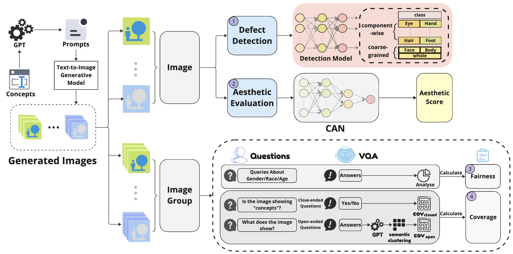

# EvaluatingAIGC

This repository contains the code implementation and a generated human image dataset annotated with defective areas for the paper: [Evaluating text-to-image generative models: An empirical study on human image synthesis](https://arxiv.org/pdf/2403.05125). 

In the paper, we evaluate Text-to-Image (T2I) generative models based on various criteria, including aesthetics, image defects, text-image alignment, and fairness.



## Defect Image Dataset
We also release the annotated defect image dataset introduced in the paper, which contains around 10,000 generated human images. Each image is manually annotated with labels on ten human body components:
- **0**: Invisible
- **1**: Correct
- **2**: Defect

You can download the dataset using the following link: [Download Dataset](https://mycuhk-my.sharepoint.com/:u:/g/personal/1155183733_link_cuhk_edu_hk/EX4v5IT3MxlHmuM3Q9HoNogBY-zqQWI1Ve2Ogh-MmdAgcg?e=w9kRRW)

**IMPORTANT**: This dataset contains uncomfortable content.

## Getting Started

### Prerequisites
Make sure you have Python installed, along with the required dependencies. Install them using:
```
pip install -r requirements.txt
```
Download Aesthetic model ckpt from : [Download ckpt](https://drive.google.com/file/d/1iC7Q7vxff2SlY4ePRUkqMA0USTL8xmHf/view?usp=drive_link)

### Running the Evaluation
To evaluate the images, use the following command:
```
python run.py --image-dir YOUR_IMAGE_PATH
```
Replace `YOUR_IMAGE_PATH` with the path to the directory containing your images. The output will include assessments of aesthetic quality, image defects, and fairness-related attributes.

### Example Output
The evaluation script will generate a report with the following metrics:
- **Aesthetic Score**: Measures the visual appeal of the generated images.
- **Image Defects**: Identifies common defects such as incorrect body proportions or artifacts.
- **Fairness Metrics**: Assesses fairness-related attributes, including potential biases in generated content.

## Citation
If you find this repository or our paper helpful, please consider citing us:
```
@article{chen2024evaluating,
  title={Evaluating text-to-image generative models: An empirical study on human image synthesis},
  author={Chen, Muxi and Liu, Yi and Yi, Jian and Xu, Changran and Lai, Qiuxia and Wang, Hongliang and Ho, Tsung-Yi and Xu, Qiang},
  journal={arXiv preprint arXiv:2403.05125},
  year={2024}
}
```
